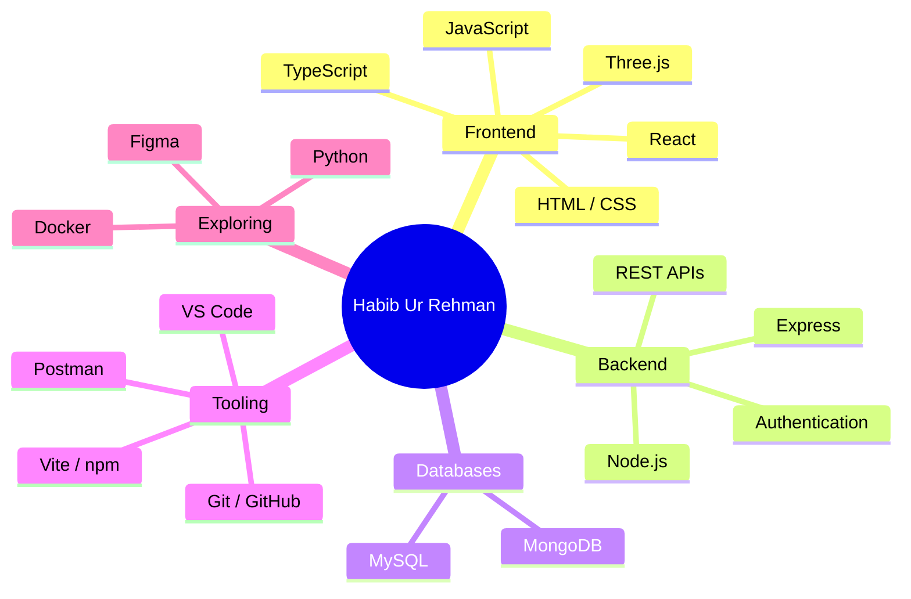
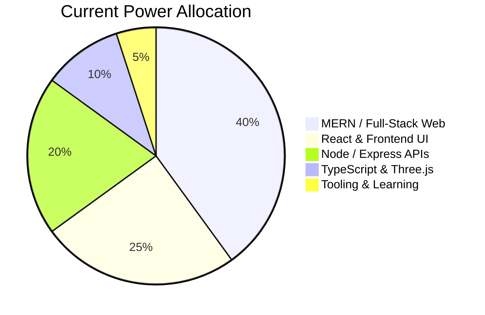

<div align="center">


<p align="center">
 
  <a href="https://github.com/HabibRehman001"></a>
   &nbsp;&nbsp;
  <a href="mailto:khuwajaabdulrehman046@gmail.com"></a>
  
</p>

</div>

---

<div align="center">

## 🐍 Contribution Snake

<picture>
  <source media="(prefers-color-scheme: dark)" srcset="https://raw.githubusercontent.com/HabibRehman001/HabibRehman001/output/snake-dark.svg" />
  <source media="(prefers-color-scheme: light)" srcset="https://raw.githubusercontent.com/HabibRehman001/HabibRehman001/output/snake.svg" />
  
</picture>

</div>


## 🎮 Character Sheet

<table>
<tr>
<td width="50%">

### ⚔️ Identity Loadout

| Attribute | Value |
|---|---|
| 🧑‍💻 **Player** | Habib Ur Rehman |
| 🏷️ **Class** | MERN Stack Developer |
| 🧙 **Subclass** | Full-Stack Engineer / JavaScript Enthusiast |
| ⚔️ **Weapons** | JavaScript, React, Node.js, Express, MongoDB |
| 🛡️ **Armor** | Git, HTML/CSS, TypeScript, Three.js |
| 🧟 **Enemies** | Flaky Deployments, Scope Creep, 2 AM Prod Crashes |

</td>
<td width="50%">

### 🔥 Live Attributes

```text
HABIB.EXE initialized
HP:       ██████████ 100%
MERN:     █████████░  90%
React:    ████████░░  80%
Node:     ████████░░  80%
TS:       ███████░░░  70%
Sleep:    ███░░░░░░░  30%
Grass:    ██░░░░░░░░  20%
```

</td>
</tr>
</table>

---

## 🧙‍♂️ About Me


Hey there, I'm **Habib Ur Rehman** — a passionate **MERN Stack Developer** and **Full-Stack Engineer** focused on building modern, responsive, and scalable web applications. I work across **React**, **Node.js**, **Express**, and **MongoDB**, with growing depth in **TypeScript** and **Three.js**.

Whether shipping UI, wiring APIs, or polishing the full stack end to end, I make sure the product ships—cleanly, efficiently, and on schedule. 🚀

<br clear="right" />


<div align="center">

## 🧰 Inventory / Tech Stack


### 🗡️ Languages & Core


### ☁️ Cloud, Hosting & Runtime


### 🧩 Frameworks & Libraries


### 🏰 Databases, Web Servers & Design


### 🤖 Data Science, ML & Version Control


### 🛠️ DevOps, Tools & Platforms


### 📊 Project Management & Teamwork
<p align="center">
  <a href="https://www.notion.so" title="Notion"></a>
  <a href="https://www.figma.com" title="Figma"></a>
</p>

</div>


<div align="center">

## 📊 GitHub Battle Stats


<br/><br/>


<br/><br/>


<br/><br/>


<br/><br/>


</div>

---

## 🕹️ Role Selection Screen

| Archetype | Core Directive | Passive Ability | Ultimate Ability |
|---|---|---|---|
| 💻 **MERN Stack Developer** | Build full-stack web apps | Ships React + Node end to end | `Merge Request Execution` |
| ⚛️ **Frontend Engineer** | Craft responsive UIs | Turns designs into clean components | `Pixel-Perfect Render` |
| 🟢 **Backend Engineer** | Design APIs & data flows | Wires Express routes to MongoDB | `Schema Storm` |
| 🎨 **UI / Motion Explorer** | Push visual polish | Experiments with CSS & Three.js | `Orbit Mode` |
| 🧰 **JavaScript Enthusiast** | Deepen the language core | Keeps learning TS and modern JS | `Type Guard Unlock` |

---

## 🧠 Skill Tree



---

## 📊 Brain Power Allocation



---

## 🧾 Quest Log

| Quest Name | Status |
|---|---|
| Build and ship MERN full-stack projects | ✅ Completed |
| Practice React, Node, and MongoDB end to end | ✅ Completed |
| Explore TypeScript across app projects | 🟩 Active |
| Push into Three.js / 3D on the web | 🟨 In Progress |
| Keep shipping modern, responsive web apps | ♾️ Eternal Quest |
| Answer "Is the API ready yet?" | ⏱️ Constant Cooldown |
| Touch grass | ❌ Optional DLC |


### ✍️ Random Dev Quote


## 🏆 Achievements Unlocked

| Achievement | Description |
|---|---|
| ⚛️ React Ranger | Built interactive UIs with component-driven React |
| 🟢 Node Navigator | Wired Express APIs and backend flows |
| 🍃 Mongo Mercenary | Modeled and queried MongoDB collections |
| 📦 Full-Stack Finisher | Delivered end-to-end MERN applications |
| 🧊 Orbit Initiate | Started exploring Three.js and typed stacks |
| ☕ Standup Survivor | Kept shipping through bugs, builds, and late nights |

---

<div align="center">

## 🧿 Developer Mood Board


</div>
