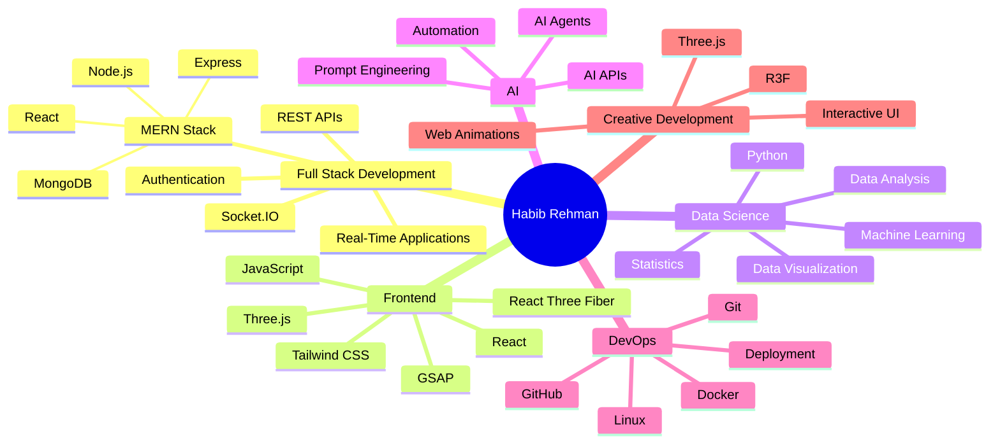
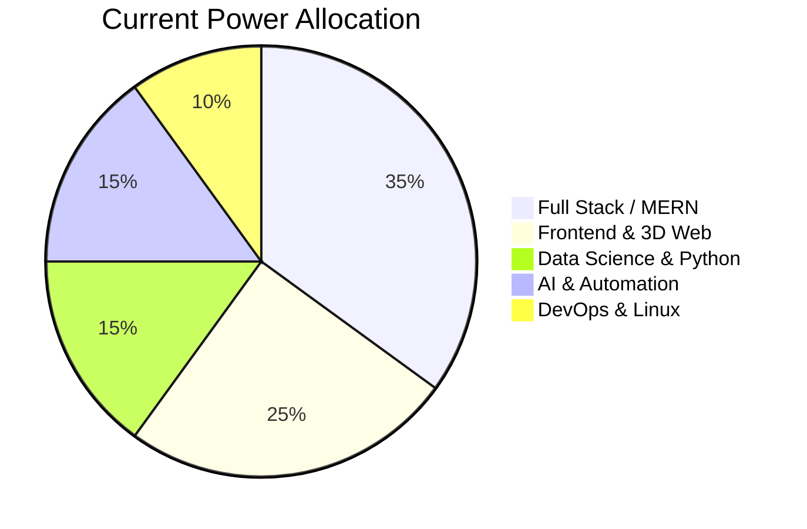

<div align="center">


<p align="center">

<a href="YOUR_INSTAGRAM_URL"></a>
  

<a href="YOUR_GOOGLE_DEV_URL"></a>
  

<a href="YOUR_GITHUB_URL"></a>
  

<a href="YOUR_LINKEDIN_URL"></a>
  

<a href="mailto:YOUR_EMAIL"></a>

</p>

</div>

---

<div align="center">

## 🐍 Contribution Snake

<picture>
  <source
    media="(prefers-color-scheme: dark)"
    srcset="https://raw.githubusercontent.com/YOUR_GITHUB_USERNAME/YOUR_GITHUB_USERNAME/output/github-contribution-grid-snake-dark.svg"
  />
  <source
    media="(prefers-color-scheme: light)"
    srcset="https://raw.githubusercontent.com/YOUR_GITHUB_USERNAME/YOUR_GITHUB_USERNAME/output/github-contribution-grid-snake.svg"
  />
  
</picture>

</div>


## 🎮 Character Sheet

<table>
<tr>
<td width="50%">

### ⚔️ Identity Loadout

| Attribute        | Value                                                  |
| ---------------- | ------------------------------------------------------ |
| 🧑‍💻 **Player** | Habib Rehman                                           |
| 🏷️ **Class**    | Full Stack Developer                                   |
| 🧙 **Subclass**  | Data Science Student / AI Enthusiast                   |
| ⚔️ **Weapons**   | JavaScript, React, Node.js, MongoDB, Python, C++       |
| 🛡️ **Armor**    | Git, GitHub, Linux, Tailwind, REST APIs                |
| 🧟 **Enemies**   | Bugs, Broken Builds, Deployment Errors, 3 AM Debugging |

</td>
<td width="50%">

### 🔥 Live Attributes

```text
HABIB.EXE initialized
HP:       ██████████ 100%
MERN:     █████████░  90%
Frontend: █████████░  90%
Backend:  ████████░░  80%
AI/DS:    ███████░░░  70%
3D Web:   ████████░░  80%
Sleep:    ███░░░░░░░  30%
Grass:    ██░░░░░░░░  20%
```

</td>
</tr>
</table>

---

## 🧙‍♂️ About Me


Hey there, I'm **Habib Rehman** — a **Full Stack Developer** and **Data Science student** passionate about building modern web applications, interactive 3D experiences, and intelligent software solutions.

I work primarily with the **MERN stack**, while exploring **Data Science, AI, automation, and 3D web development**. I enjoy turning ideas into functional products — from real-time collaborative coding platforms to immersive Three.js experiences.

I'm constantly experimenting with new technologies, improving my problem-solving skills, and building projects that push me beyond conventional web development. 🚀

<br clear="right" />


<div align="center">

## 🧰 Inventory / Tech Stack


### 🗡️ Languages & Core


### ⚛️ Frontend


### ⚙️ Backend & Runtime


### 🗄️ Databases


### 🤖 Data Science & AI


### 🐳 DevOps & Tools


### 🎨 Design & Creative Development


</div>


<div align="center">

## 📊 GitHub Battle Stats


<br/><br/>


<br/><br/>


</div>

---

## 🕹️ Role Selection Screen

| Archetype                   | Core Directive                         | Passive Ability                           | Ultimate Ability       |
| --------------------------- | -------------------------------------- | ----------------------------------------- | ---------------------- |
| ⚛️ **Full Stack Developer** | Build complete web applications        | Connects frontend with powerful backends  | `Full Stack Overdrive` |
| 🎨 **Frontend Engineer**    | Create interactive user experiences    | Turns UI ideas into responsive interfaces | `Pixel Perfect Mode`   |
| 🤖 **AI / Data Explorer**   | Explore AI, ML & data science          | Finds patterns inside messy datasets      | `Pattern Recognition`  |
| 🌐 **3D Web Developer**     | Build immersive browser experiences    | Makes websites move in 3D                 | `Reality Distortion`   |
| 🐧 **Linux Developer**      | Build and deploy software environments | Survives the terminal                     | `sudo rm -rf Problems` |

---

## 🧠 Skill Tree



---

## 📊 Brain Power Allocation



---

## 🧾 Quest Log

| Quest Name                                   | Status         |
| -------------------------------------------- | -------------- |
| Build production-ready MERN applications     | 🟩 Active      |
| Master advanced React & frontend development | 🟩 Active      |
| Build real-time collaborative applications   | ✅ Completed    |
| Explore AI-powered development workflows     | 🟨 In Progress |
| Master Data Science & Machine Learning       | 🟨 In Progress |
| Build immersive Three.js experiences         | 🟩 Active      |
| Improve DSA & problem-solving skills         | 🟨 In Progress |
| Touch grass                                  | ❌ Optional DLC |

---

### ✍️ Random Dev Quote


## 🏆 Achievements Unlocked

| Achievement              | Description                                                           |
| ------------------------ | --------------------------------------------------------------------- |
| ⚛️ MERN Warrior          | Built full-stack applications using MongoDB, Express, React & Node.js |
| 🌐 Real-Time Architect   | Built collaborative real-time coding experiences                      |
| 🎨 3D Experience Builder | Created interactive Three.js / React Three Fiber experiences          |
| 🤖 AI Explorer           | Integrated AI-powered development workflows                           |
| 🐧 Terminal Survivor     | Survived Linux configuration and deployment battles                   |
| 🚀 Deployment Warrior    | Deployed applications and handled production debugging                |
| 🧠 Data Apprentice       | Building foundations in statistics, Python and data science           |
| ☕ Debugging Addict       | Fixed one bug just to create three more                               |

---

<div align="center">

## 🧿 Developer Mood Board


</div>
