  

### why this orbit

Eight tools, one orbit — MERN at the outer ring, TypeScript and Three.js closer to the center. I build modern, responsive, scalable web apps and keep the stack tight so every layer earns its place.

### what's at the center this week

> TypeScript + Three.js — typing the stack and pushing into 3D on the web.

— [@HabibRehman001](https://github.com/HabibRehman001)
